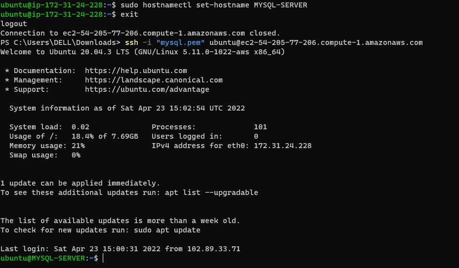
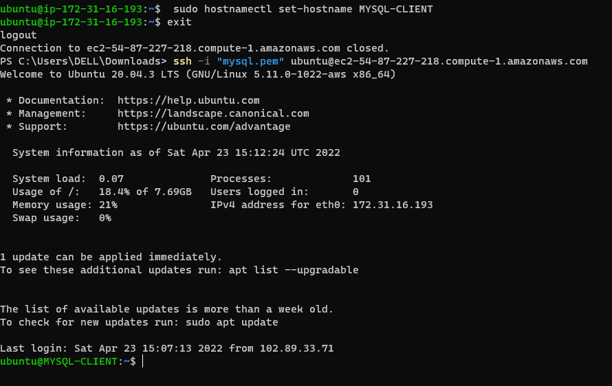
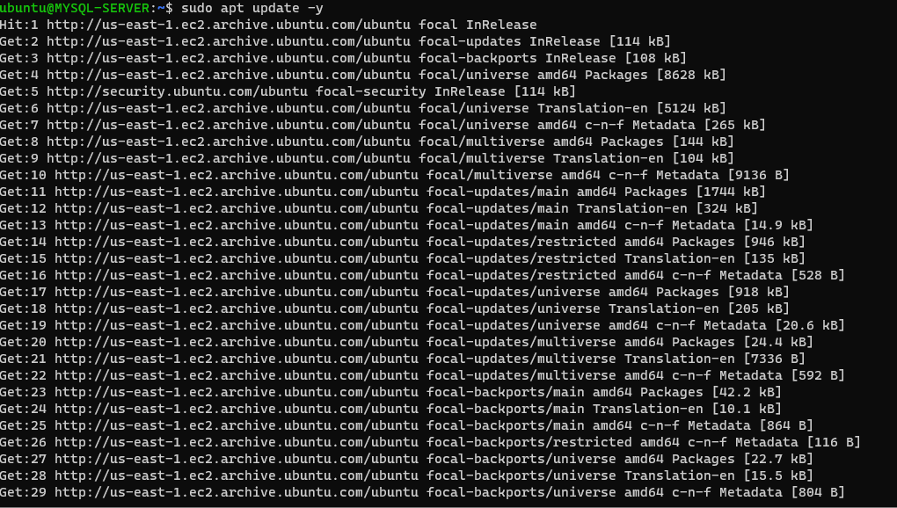
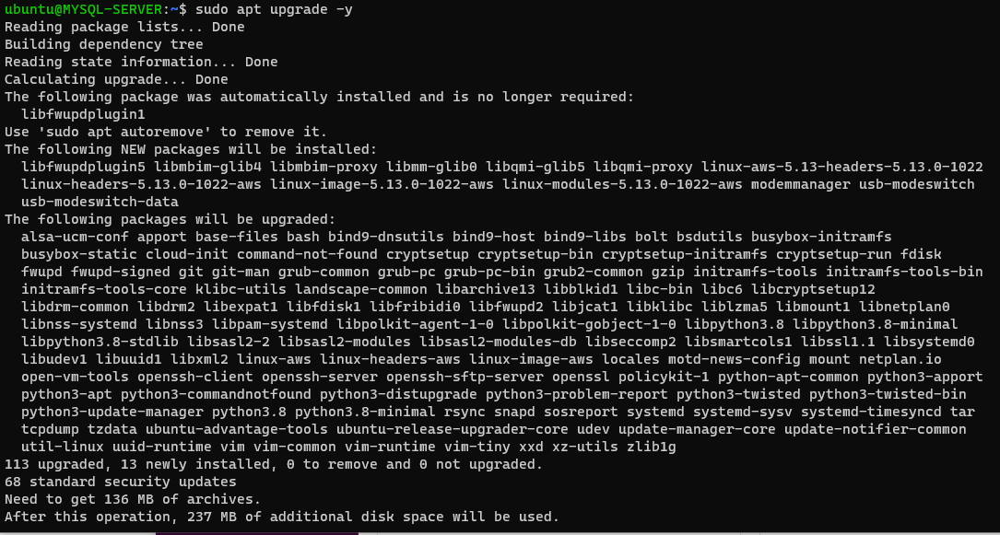
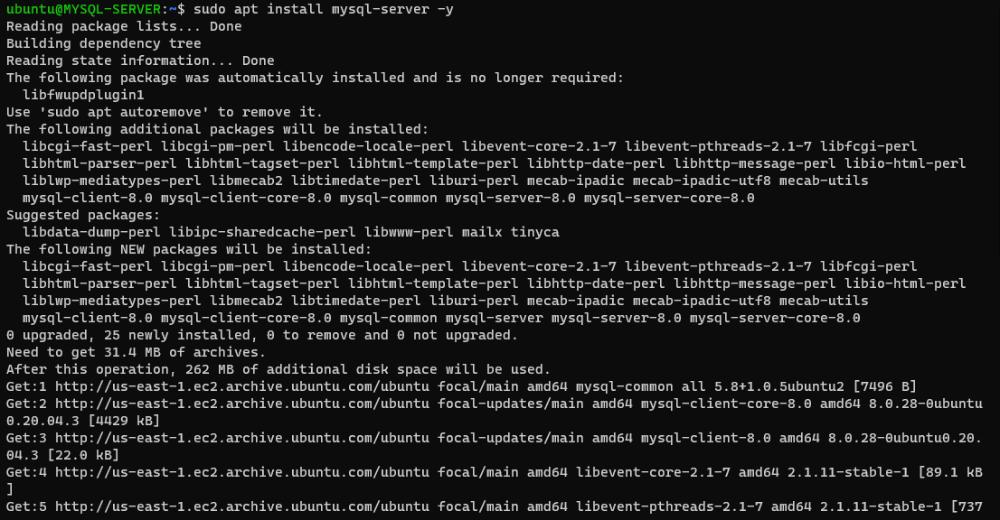
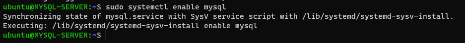
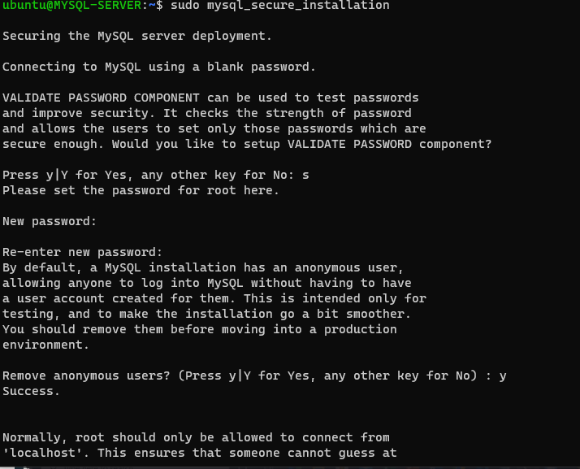
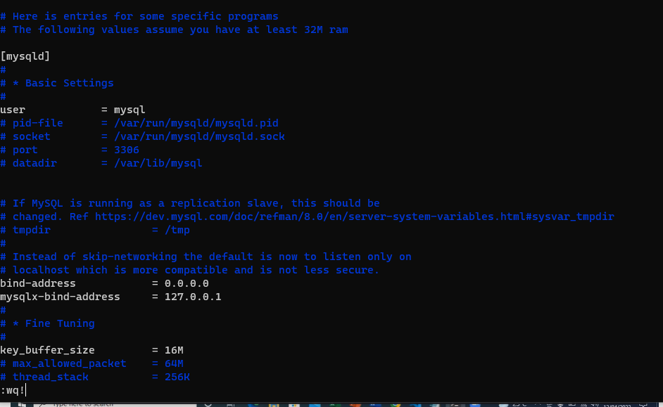
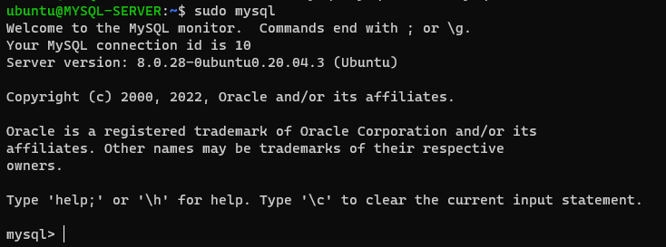
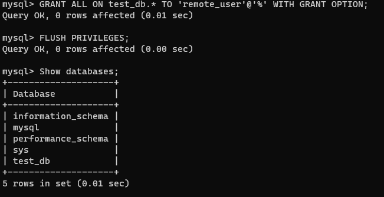

# Documentation of project 5

a. I created and configured two linux based virtual servers and named them 'mysql-server" and "mysql-client" respectively.
   	

b. I set host-name for the two servers in my terminal
         `sudo hostnamectl set-hostname mysql-server `

         `sudo hostnamectl set-hostname mysql-client`
     	
         	
c.   I updated the server on both terminals
      `sudo apt update -y`
      	

d.  I upgraded the server on both terminals
      `sudo apt upgrade -y`
      	

e.   I installled mysql server
      `sudo apt install mysql-server -y`
      	

f.   I enabled mysql
       `sudo systemctl enable mysql`
       	

g.   I secured installation of mysql
       `sudo mysql_secure_installation`
       	

h.   I configured mysql server to allow connections from remote hosts
       `sudo vi /etc/mysql/mysql.conf.d/mysqld.cnf`
       

i.  I tried connecting from the mysql-client to the mysql-server
        
        
	

    